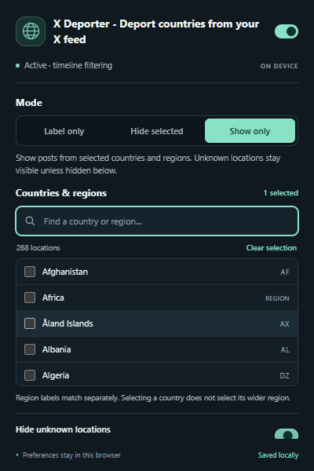

# X Deporter

Show X's public **account country or region in small blue text beneath the display name** (for example, “Libs of TikTok”), and filter posts using either a hide list or an allow list. Built for desktop Brave and other Chromium browsers using Manifest V3.

**v0.1.3 is a beta.** The filtering, popup, and request bridge have automated coverage. Authenticated lookups have not yet been verified in a live X session. X's undocumented endpoint can change; the extension reports lookup failures and leaves unresolved locations as Unknown.




## Download and install

1. Download **xdeporter-v0.1.3.zip** from [Releases](https://github.com/ceo-of-slop/xdeporter/releases).
2. Extract the ZIP to a permanent folder. Keep that folder after installing.
3. Open `brave://extensions`, enable **Developer mode**, and click **Load unpacked**.
4. Select the extracted folder that contains `manifest.json`.
5. Pin **xdeporter** in the extensions menu. Refresh X after installing and sign in normally.

This release is an unpacked extension, not a Chrome Web Store listing or a signed CRX. It does not need a build step, API key, or paid service.

To update, replace the files in your existing extension folder with the new release, click **Reload** on the extension card at `brave://extensions`, and refresh X.

## Use it

- **Label only:** display account locations with no filtering.
- **Hide selected:** hide posts whose author matches a selected country or region.
- **Show only:** hide posts from known locations outside your selection. An empty selection hides all known locations.
- **Hide unknown locations:** also hide authors whose location is absent or has not resolved yet. Unknowns stay visible by default.
- **Look up account labels:** check authors automatically. Turn this off to use cached results and information encountered when you open X's About pages.
- **Master toggle:** turn off badges and filtering immediately, restoring hidden posts.

Search the popup for countries or regions. Changes apply immediately to open X tabs. Click a badge to open that author's About page. Region-only labels match separately: selecting India does not also select South Asia.

Filtering changes the posts displayed in your browser. It does not block or mute accounts on X, remove their content from X's servers, filter notifications/DMs, or change what other people see. A repost is filtered by the original post author. Quoted content is not filtered separately from the outer post author. Badges may appear progressively as lookups finish.

## What the label means

The extension uses X's **Account based in** field, inferred by X from aggregated IP addresses. It is not nationality, citizenship, a verified current location, or the location a particular post was sent from. X may publish only a region or no value. Profile biographies, free-text profile locations, names, and languages are never used to guess a country.

Read [X's explanation](https://help.x.com/en/managing-your-account/how-to-change-country-settings) and the [implementation sources and limitations](docs/SOURCES.md).

## Privacy and permissions

- Runs only on `x.com` and `twitter.com`, including their `www` hosts.
- The only extension API permission is `storage`.
- Stores filter settings and up to 5,000 username/location cache records locally in this browser. No sync, analytics, remote database, or third-party lookup service.
- Country records expire after 24 hours; missing-country records expire after one hour. Expired records are ignored and pruned on later writes. Clear cache removes records immediately; automatic browsing lookups can populate it again.
- The page bridge uses the existing signed-in X session for read-only requests. Selected session headers stay in page memory; they are not written to storage or sent through extension messages. There is no password collection or hard-coded bearer credential.
- Lookups are sequential, at least two seconds apart per tab. Rate-limit responses pause requests. Several X tabs can share X's server-side quota.

## If labels remain Unknown

Open the popup and read the connection status. Sign in and refresh the X tab. Open an account's **About this account** page once; observing that request can refresh the private endpoint identifier and feature flags. Cached labels continue to work during temporary failures. If X rejects requests or changes its API/markup, an extension update may be necessary. Report an issue without including cookies, session headers, or private account data.

## Development

There are no runtime dependencies or bundled remote scripts. Load the `extension/` folder directly in Brave.

```sh
npm test
```

Runs the country/filter, background storage, and isolated page-bridge tests with Node.js 20 or newer. Browser integration tests use a local synthetic timeline and mocked extension storage; all page requests are intercepted, and no X account is accessed:

```sh
npm install --no-save playwright
npx playwright install chromium
npm run test:browser
```

Alternatively set `PLAYWRIGHT_MODULE` to an installed Playwright module path and `BROWSER_EXECUTABLE_PATH` to a Chromium executable. Set `TEST_ARTIFACT_DIR` to choose where test screenshots are saved. These offline tests do not establish compatibility with X's live endpoint.

To package on Windows, run `./scripts/package.ps1`; the ZIP contains the extension files directly at its root. GitHub Actions runs the unit tests for pushes and pull requests.

## License

MIT. Copyright (c) 2026 ceo-of-slop. Not affiliated with X or Brave.
